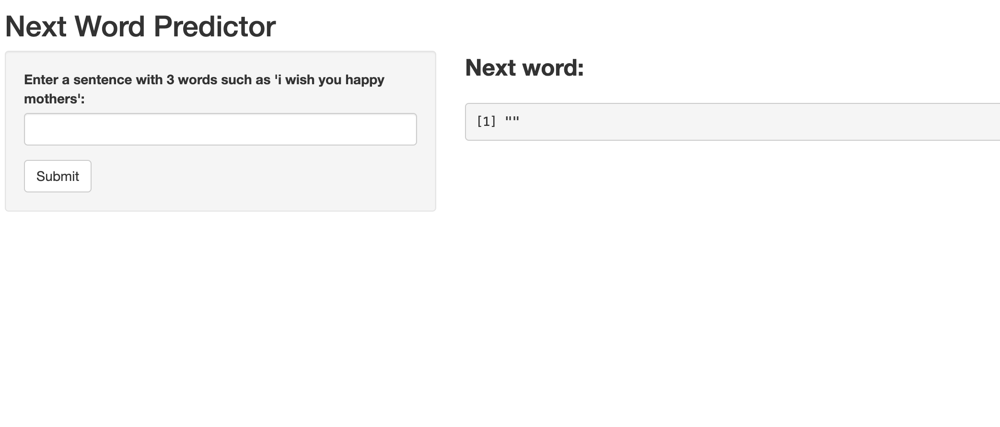

```{r setup, include=FALSE}
knitr::opts_chunk$set(echo = FALSE)
```

## Introduction

This is the final project submission for the Data Science Capstone Project which is part of Data Science track in Coursera. 

The purpose of this project to build a prediction model to predict the next word given a sentence from the input.

## Approach to the Model

- In order to build the model, a corpus was built by using the dataset which contains blog, news and twitter data.

- Sample size of 1% used in order to select from corpus so that performance of the model is manageable.

- After cleaning and sampling the data ngrams were built which contains unigrams, bigrams and trigrams.

- Model takes the last 2 words of the inputted sentence and uses the trigrams to predict the next word.

## User Interface

User interface for this application expects the user to enter a sentence and click submit.

```{r}

```

## Shiny Application

A shiny application to test the model can be found in the following website: https://msoysal.shinyapps.io/Predict_Next_Word/

All the files for this project can be found in the following github page:
https://github.com/marino35/Data-Science-Capstone-Project

